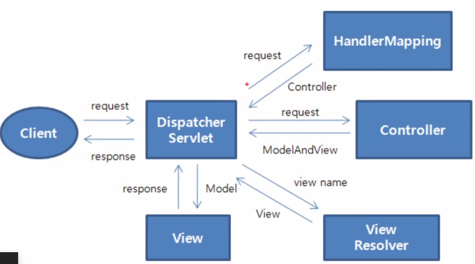

### 프레임워크의 종류
- front : 리엑트, 뷰, 앵글러 등 -> ajax등 쉽게사용가능
- back : 스프링(java의 99%), jsf 등  

### 스프링 프레임워크
- 스프링자체는 자바 뿐 만이 아니라 코틀린, c++ 등도 지원
- 핵심기능1 : 제어의 역전(Inversion of Control; IoC)을 통한 의존성주입(dependency injection)  
  - IoC?  
    - 디자인 패턴 중 하나 -> 객체의 생성과 소멸, 객체간 관계 제어를 개발자가 하는게 아니라 프레임워크에서 수행
    - 클래스간 결합을 느슨하게 설계하여 테스트, 유지보수가 용이 -> 유연하고, 모듈화된 소프트웨어 개발가능
    - 이런 제어의 반전 패턴을 달성하는 방법 중 하나가 의존성 주입(DI)
  - DI?
    - 사용할 오브젝트에 대한 레퍼런스를 **외부**에서 제공(주입)해 줌 -> by **생성자/setter**
	- DI로 구현하면 의존대상이 변화하더라도 그에 맞게 수정할일이 없거나 줄어들게 됨
	- 기능별로 코드를 분리하게 되어, 재사용성↑ 가독성↑  
	- [햄버거 가게를 예시로한 좋은 설명글!](https://tecoble.techcourse.co.kr/post/2021-04-27-dependency-injection/)
- 핵심기능2 : 트랜잭션관리(transaction management) 
- spring boot / spring framework  
  : 기능 완벽하게 같음~ 단지, 후자는 설정할것이 많고 전자는 설정이 간소화 되어있음
  
### 설치과정
- 이클립스에 플러그인 설치 필요 -> 근데 스프링자체에서 내부에 플러그인 다 넣어놓은 이클립스를 배포
- spring tool suite(sts)
- 4.15.3 처럼 4로 시작하는거는 spring boot이라서 다운X (spring framework쓸거임)
- Looking for Spring Tool Suite 3? -> Suite 3 wiki로 드감
- Spring Tool Suite 3.9.15 (New and Noteworthy) 안에보면
- full distribution on Eclipse 4.16이거있음 이게 우리가 계속 쓰던 이클립스임
- zip파일로 다운받아 실행하면 우리가 기존에 쓰던 이클립스랑 같음
  
### 스프링의 구조 살펴보기
- new -> spring legacy project -> spring mvc project로 생성 -> [hello](../220901_hello/)
- src/main/java : 자바파일 관리
- src/main/resources : 자바에서 쓸 정적 자원들 담기
- src/test/java,resources : 테스트용
- src/main/webapp : 여기가 jsp넣으면 되는곳
- run on server 하면 나오는 VMware가 걍 톰캣! 내장되어 있는거~

### 스프링의 기본 코드
- DispatcherServlet
  - 위에서 만든 spring mvc project인 hello의 web.xml가보면 servlet을 단! 하나 연결하고 있음
  ```  
  <servlet>
	  <servlet-name>appServlet</servlet-name>
	  <servlet-class>org.springframework.web.servlet.DispatcherServlet</servlet-class>
	  <init-param>
		  <param-name>contextConfigLocation</param-name>
		  <param-value>/WEB-INF/spring/appServlet/servlet-context.xml</param-value>
	  </init-param>
	  <load-on-startup>1</load-on-startup>
  </servlet>
  ```  
  - 즉, 스프링에 내장된 DispatcherServlet이 모든 요청을 가장 먼저 받음! (프론트 컨트롤러)  
  - -> DispatcherServlet은  공통적인 작업을 먼저 처리한 후에 해당 요청을 처리해야 하는 컨트롤러를 찾아서 작업을 위임  
  - 디스패처서블릿의 동작과정 도식화  
    
  - [디스패처 서블릿의 개념과 동작 과정을 상세히 설명해준 포스트](https://mangkyu.tistory.com/18)  
- spring-context
  - pom.xml가면 dependency중에 spring-context가 있음  
  - 얘가 의존성주입해줌 <- 내가 맡기면 bean이라는 이름으로 관리!  
  > 수동으로 라이브러리 추가해보기  
  > java프로젝트 -> maven -> (저 spring-context가 없는 상태임) -> mvn레파지토리ㄱㄱ  
  > spring-context, spring-core, spring-beans [pom.xml에 추가하기](../220901_ioc/pom.xml)  
  > 버전은 꼭 같게 설정! -> 프로펄티줘서 한방에 관리하면 좋음 
- context?
  - 스프링이 관리하는 빈들이 담겨 있는 컨테이너
  - 스프링 프로젝트에 기본으로 있는 web.xml에 보면 root-context와 servlet-context가 있음  

<details><summary style="color:skyblue">web.xml보기</summary>
<p>
  
```html
<context-param>
	<param-name>contextConfigLocation</param-name>
	<param-value>/WEB-INF/spring/root-context.xml</param-value>
</context-param>
	
<listener>
	<listener-class>org.springframework.web.context.ContextLoaderListener</listener-class>
</listener>

<servlet>
	<servlet-name>appServlet</servlet-name>
	<servlet-class>org.springframework.web.servlet.DispatcherServlet</servlet-class>
	<init-param>
		<param-name>contextConfigLocation</param-name>
		<param-value>/WEB-INF/spring/appServlet/servlet-context.xml</param-value>
	</init-param>
	<load-on-startup>1</load-on-startup>
</servlet>
		
<servlet-mapping>
	<servlet-name>appServlet</servlet-name>
	<url-pattern>/</url-pattern>
</servlet-mapping>
```  
  
</p>  
</details>  

  - 흐름  
  -> \<context-param\>으로 root-context를 설정  
  -> ContextLoaderListener가 contextConfigLocation 값인 root-context를 불러옴  
  -> 요청이 오면 \<servlet\>태그를 읽어내면서 DispatcherServlet 클래스를 실행! with servlet-context, root-context  
  - 정리
  : web.xml에서 ContextLoaderListener를 이용하여 root-context를,  
  DispatcherServlet를 이용하여 servlet-context를 생성
  - root-context VS servlet-context
    - dispatcherServlet이 여러개 존재해야 하는 경우에 차이점이 부각됨~
    - **root-context** : 여기에 등록되는 빈들은 모든 서블릿에서 사용가능 -> **Service와 Repository(Dao) 담당** 
    - **servlet-context** : 여기에 등록되는 빈들은 해당 서블릿에서만 사용가능 -> **Controller 담당**

### xml로 bean관리
- [MyBean](../220901_ioc/src/mybeans/MyBean.java)클래스와 이를 의존하는 [MyLogic](../220901_ioc/src/mybeans/MyLogic.java)클래스(by 생성자 or setter), 필드값 가지는 [MyStatefulObj](../220901_ioc/src/mybeans/MyStatefulObj.java)를 바탕으로 test!  
- bean은 일반적으로 xml파일에 정의
  - new -> spring bean configuration file -> `xml파일`이 만들어짐 
  - ★[.xml의 \<beans\>태그 안에 \<bean\>생성](../220901_ioc/src/myconfig.xml) -> ioc컨테이너에 갖다 **<<맡김!!>>**
  - class attribute 필수!
  - \<constructor-arg ref="등록한 빈 id"\>로 의존성 처리가능 -> 할거면 해당클래스에 생성자가 있기는 해야함 
  - \<constructor-arg value=""\>쓰면 생성자로 값 넣는것도 **외부에서** 가능 -> 필드순서대로임~
  - \<property name="필드명" value="값"\>쓰면 setter로 값 넣는것도 **외부에서** 가능 
  - scope attribute : singleton(default) / prototype(IoC관리대상X)
  - primary attribute
- [IoC X일 때 test](../220901_ioc/src/Main.java)
- ★[IoC O일 때 test](../220901_ioc/src/IOC_Test.java)
  - ApplicationContext context = new ClassPathXmlApplicationContext("xml파일이름");해주면
  - .getBean(클래스)하면 빈을 알아서 **<<꺼내서>>** 깔끔히 반환해줌~
- 결론-> bean부를때 1.클래스이름으로 부르기 2.id값으로 부르기 3.primary설정해놓기

### @annotation으로 bean관리
- [xml파일에 할 일](../220901_iocAnno/src/myconfig.xml)
  - 새로 만든 spring bean configuration file가서 namespaces탭 -> context체크
  - 그러고 나면 이제 context태그를 사용할 수 있게 됨
  - \<context:component-scan base-package="패키지명"\>  
  : 해당 패키지안에 component어노테이션 붙은 애를 스캔함  
  - \<context:annotation-config></context:annotation-config\>  
  : @Autowired나 @Qualifier를 쓰기 위해! 근데 context:component-scan했으면 안해도 됨
- bean등록할 class에 할 일 
  - @Component어노테이션 붙이기
  - id 붙이고 싶으면 @Component에다가 [value로 넣으면 됨](../220901_iocAnno/src/mybeans/FirstComponent.java) value생략도 가능
  - 의존성주입 받아야하는 클래스에서는 어떤방식(생성자/setter)으로 주입받고싶으냐에 따라 [@Autowired 위치가 달라짐](../220901_iocAnno/src/mybeans/SecondComponent.java)
  - @Autowired를 세군데 다 붙여도 됨~ ㅎㅎ (밑에서 짝꿍인 @Qualifier체크)
  - [@Scope(value="prototype"), @Primary, 생성자에 외부에서 값 넣기도 @Value로 다 됨](../220901_iocAnno/src/mybeans/ThirdComponent.java)
- [test결과](../220901_iocAnno/src/TestComponent.java)
  - ApplicationContext context = new ClassPathXmlApplicationContext("xml파일이름");해주면
  - xml가서 component-scan -> @Component붙은애들 getBean(클래스)로 꺼내와줌~
  
### ioc컨테이너에 관리대상으로 등록하는 방법 
1. xml에 bean으로 전부 다 등록하기  
2. java annotation 사용하기(xml은 부가적인느낌)

### 인터페이스의 구현체가 여러개일 때 의존성 주입 실전!
- @Primary는 인터페이스 등장할때 중요해짐!! -> [test](../220901_javaConfig/src/kr/co/greenart/Test.java)
  - bean부를때 인터페이스로 부르면 구현체를 들고오니깐 [A](../220901_javaConfig/src/kr/co/greenart/MyListRepository.java),[B](../220901_javaConfig/src/kr/co/greenart/MySetRepository.java),C.. 중 어느 구현체를 들고올지를 정함
- ★[@Qualifier](../220901_javaConfig/src/kr/co/greenart/MyService.java ) <- @Autowired할건데 어느애로 들고올건지 정해주는거
- @Service, @Repository, @controller 다 같은 @component인데 이름만 다르게 지정한거 -> **Streotype** 
  - @Configuration도 @component와 별 차이 없다. 단, 개발자가 직접 제어가 불가능한 클래스의 경우 @Configuration + @Bean어노테이션으로 bean 등록!!

### 외부에서 가져온 클래스를 bean으로 관리하기
- `@bean`을 메소드위에 붙이면 됨. 해당 메소드의 리턴타입이 bean등록하고 싶은 놈이 되는거임~
- 그러기 위해서는  
  : 1. 어노테이션을 쓸거니 conponent-scan 해야함  
  : 2. '메소드'가 있어야 하니 태그가 아닌 자바 코드로 작성해야함 xml->java  
- [기존의 conponent-scan태그 먹이던 xml파일](../220901_javaConfig/src/component-scan.xml) -> [java파일 @ComponentScan](../220901_javaConfig2/src/kr/co/greenart/MyConfig.java)
```java
//이렇게 @Configuration, @ComponentScan 먹여놓은 java파일에 @Bean등록!
@Bean
public List<Integer> myList() { 
	return new ArrayList<>(Arrays.asList(1,2,3,4,5));
}
//부를때는,
@Autowired
private List<Integer> list; //일케하면 List<Integer>에 대한 bean을 찾고, 그게 바로 위에서 설정한 애임 
```  
> 기존의 List/Set bean등록 안한 경우 : [MyListRepository](/220901_javaConfig/src/kr/co/greenart/MyListRepository.java), [MySetRepository](../220901_javaConfig/src/kr/co/greenart/MySetRepository.java), [MyService](../220901_javaConfig/src/kr/co/greenart/MyService.java)  
> List/Set bean등록 한 경우 : [MyListRepository](../220901_javaConfig2/src/kr/co/greenart/MyListRepository.java), [MySetRepository](../220901_javaConfig/src/kr/co/greenart/MySetRepository.java), [MyService](../220901_javaConfig/src/kr/co/greenart/MyService.java)
- test파일의 context도 변경: [ClassPathXmlApplicationContext("xml경로")](../220901_javaConfig/src/kr/co/greenart/Test.java) -> [AnnotationConfigApplicationContext(클래스명)](../220901_javaConfig2/src/kr/co/greenart/Test.java)

### Spring에서 지원하는 MVC살펴보기

- @Controller에는 @RequestMapping하는 애들만 담는걸로 암묵적 약속~
  - [helloController](../220901_hello/src/main/java/kr/co/greenart/HelloController.java)  
  : 접속 주소가 달라도 forward하는 jsp가 같으면 같은 컨트롤러로 묶기 좋음
  - [reqeustHandling](../220901_hello/src/main/java/kr/co/greenart/RequestHandling.java)  
  : ★@RequestParam을 쓰면 HttpServletRequest에서 req받아서 .getParameter("파람이름")가 한방에~!  
  : ★스프링에서는 Model이라는 값 넣을 통 따로 있다~!
  - [PrintController](../220901_hello/src/main/java/kr/co/greenart/PrintController.java)  
  : forward하는 jsp가 달라도 접속 주소가 유사하면(/A를 기점으로 가지치기 하는 경우) 같은 컨트롤러로 묶기 좋음  
  : ★@ResponseBody를 쓰면 response에서 프린터가져와 응답바디에 out하던 과정이 한방에~!

